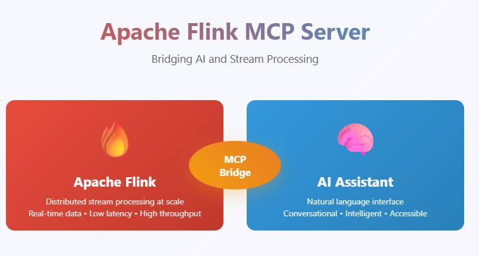

# Apache Flink MCP Server

A Model Context Protocol (MCP) server implementation for Apache Flink that enables AI assistants and large language models to interact with Flink clusters through natural language interfaces. This server provides comprehensive tools for monitoring, managing, and analyzing Apache Flink streaming applications.



## Overview

The Apache Flink MCP Server bridges the gap between AI assistants and Apache Flink clusters by providing a standardized MCP interface. It allows users to perform complex Flink operations through conversational AI, making stream processing management more accessible and intuitive.

## Features

### 🎯 Core Capabilities
- **Cluster Monitoring**: Get real-time cluster information including jobs, slots, and TaskManagers
- **Job Management**: List, monitor, and analyze Flink job details and metrics
- **Exception Tracking**: Retrieve and analyze job exceptions for debugging
- **Resource Management**: Monitor TaskManager resources and JAR file deployments
- **Metrics Collection**: Access comprehensive job and cluster metrics

### 🔧 Available Tools:

1. `initialize_flink_connection` – Connect to Flink REST API
2. `get_connection_status` – Check connection status
3. `get_cluster_info` – Overview of the Flink cluster
4. `list_jobs` – List all Flink jobs with status
5. `get_job_details` – Comprehensive job details by ID
6. `get_job_exceptions` – Fetch job-level exceptions
7. `get_job_metrics` – Fetch metrics for a job
8. `list_taskmanagers` – List TaskManagers with resources
9. `list_jar_files` – List uploaded JAR files
10. `send mail` – (Send an email notification)

---

### 🚀 Benefits
- **Natural Language Interface**: Interact with Flink using conversational AI
- **Real-time Monitoring**: Get instant insights into cluster and job status
- **Debugging Support**: Easily access exception logs and metrics
- **Resource Optimization**: Monitor resource usage across TaskManagers
- **Developer Productivity**: Reduce time spent navigating Flink Web UI

## Installation

### Prerequisites
- Apache Flink cluster (running and accessible)
- Python 3.8 or higher
- MCP-compatible client (Claude Desktop, Continue etc.)


### Client Configuration

#### Continue Desktop
Add to your Claude Desktop configuration (`Flink-mcp-server.yaml`):
```yaml
name: Sample MCP
version: 0.0.1
schema: v1
mcpServers:
  - name: Flink MCP Server
    type: streamable-http
    url:   http://127.0.0.1:9090/mcp/ 
```

## Usage Examples

### Basic Cluster Monitoring
```
Human: What's the status of my Flink cluster?
AI: I'll check your Flink cluster status for you.
[Uses get_cluster_info tool to fetch cluster overview]
```

### Job Analysis
```
Human: Show me all running jobs and their performance metrics
AI: Let me get the current jobs and their metrics.
[Uses list_jobs and get_job_metrics tools]
```

### Troubleshooting
```
Human: My job with ID abc123 is failing. Can you help me debug it?
AI: I'll check the job details and any exceptions for job abc123.
[Uses get_job_details and get_job_exceptions tools]
```

### Resource Management
```
Human: How are my TaskManager resources being utilized?
AI: Let me check your TaskManager status and resource allocation.
[Uses list_taskmanagers tool]
```

## API Reference

### Available MCP Tools

#### `get_cluster_info`
**Description**: Fetch an overview of the Flink cluster including jobs, slots, and TaskManagers.
**Parameters**: None
**Returns**: Cluster overview with resource information

#### `list_jobs`
**Description**: List all current and recent Flink jobs with their status.
**Parameters**: None
**Returns**: List of jobs with status, start time, and duration

#### `get_job_details`
**Description**: Get detailed information about a specific Flink job.
**Parameters**:
- `job_id` (string, required): The unique identifier of the Flink job

#### `list_taskmanagers`
**Description**: List all registered TaskManagers in the cluster.
**Parameters**: None
**Returns**: List of TaskManagers with resource information

#### `get_job_exceptions`
**Description**: Fetch exceptions that occurred in the specified job.
**Parameters**:
- `job_id` (string, required): The unique identifier of the Flink job

#### `list_jar_files`
**Description**: List all uploaded JAR files in the Flink cluster.
**Parameters**: None
**Returns**: List of available JAR files

#### `get_job_metrics`
**Description**: Fetch selected useful metrics for a running Flink job.
**Parameters**:
- `job_id` (string, required): The unique identifier of the Flink job


---

#### `send_mail`

**Description**: Send an email notification, such as alerts, status updates, or reports from the Flink MCP server.


## Troubleshooting

### Common Issues

**Connection Failed**
- Verify Flink cluster is running and accessible
- Ensure network connectivity to Flink JobManager

**Permission Errors**
- Verify Flink REST API is enabled
- Check if authentication is required for your Flink setup


### Debug Mode
Enable detailed logging:
```bash
export LOG_LEVEL=DEBUG
python mcp_server.py
```

## Contributing

We welcome contributions! Please follow these steps:

1. Fork the repository
2. Create a feature branch: `git checkout -b feature-name`
3. Make your changes and add tests
5. Commit your changes: `git commit -m "Add feature"`
6. Push to your fork: `git push origin feature-name`
7. Create a Pull Request

### Development Guidelines
- Follow PEP 8 style guidelines
- Update documentation as needed
- Ensure backward compatibility

## License

This project is licensed under the [MIT License](LICENSE).

## Related Projects

- [Model Context Protocol](https://github.com/modelcontextprotocol) - The MCP specification
- [Apache Flink](https://github.com/apache/flink) - Apache Flink stream processing framework
- [MCP Kafka](https://github.com/Ashfaqbs/KafkaIQ) - MCP server for Confluent/Kafka
- [MCP Container](https://github.com/Ashfaqbs/ContainMind) - MCP server forContainer's


## Support

- **Issues**: [GitHub Issues](https://github.com/Ashfaqbs/apache-flink-mcp-server/issues)
- **Documentation**: [Project Wiki](https://github.com/Ashfaqbs/apache-flink-mcp-server/wiki)

- **Discussions**: [Project Discussions](https://github.com/Ashfaqbs/apache-flink-mcp-server/discussions/)

## Acknowledgments

- Apache Flink community for the excellent stream processing framework
- Model Context Protocol team for the standardized interface
- Contributors and users of this project

---

**Note**: This MCP server provides read-only access to Flink cluster information by default. For write operations, additional configuration and security considerations may be required.